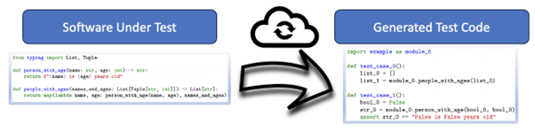

# SBFT Python Tool Competition Runner


The Workshop on [The 17th International Search-Based and Fuzz Testing (SBFT)](https://sbft24.github.io/)
offers a Python tool competition on automatic test generation for the Python programming
language.



## Important SBFT'24 Python Tool Compeetition Dates

All dates are anywhere on earth (AoE, UTC-12h):

- Tool Submission: 1. December 2023
- Results provided to tool authors: 9. January 2024
- Competition report: 16. January 2024
- Notification to authors: 21. December 2023
- Camera ready due: 25. January 2024
- Author's registration due: TBA
- Workshop: TBA April 2024

## Submission

Submit your test generator by sending an email all organizers:

- Nicolas Erni (ZHAW) - <gann@zhaw.ch>
- Al-Ameen Mohammed Ali Mohammed (ZHAW) - <alam@zhaw.ch>
- Christian Birchler (ZHAW) - <birc@zhaw.ch>
- Pouria Derakhshanfar (JetBrains) - <pouria.derakhshanfar@jetbrains.com>
- Stephan Lukasczyk (University of Passau) - <stephan.lukasczyk@uni-passau.de>
- Sebastiano Panichella (ZHAW) - <panc@zhaw.ch>

Your email should include:

- A link to the repository
  - If the repository is private then invite the competition organizers to the repository
- The name of the version tag
- The commit hash of the version tag

## Overview

In general, manual testing of software systems is costly.
Automatic test generation for Python lowers barriers to
test and ensure quality for Python software.
Therefore, the SBFT initiates a competition on Python test generation,
which enhances research and implementation for novel test generators for Python.
This repository provides the necessary facilities and guidelines
for participating in the SBFT Python tool competition.

## Test Generator Implementation

The platform provides an API for writing test cases.
You simply need to generate a `string` that represent the body of a valid Python
testing module that tests a given target with `pytest`.
Furthermore, your test code needs to be compatible with `cosmic-ray`
so that your test suite can be assessed through mutation scores.
Below you see how to use the platform to implement a generator.

## Usage

### Installation

This tool requires at least Python 3.9 and [poetry](https://python-poetry.org/).

`pip install python-tool-competition-2024`

### Creating a New Test Generator Project

Run `python-tool-competition-2024 init` and follow the instructions on the screen.
During the setup process, you need to provide the following information:

- Human-readable name of the test generator (mandatory)
- Directory in which the project will be created (by default: the current directory)
- Your full name (mandatory)
- Your email address (mandatory)
- Information required to create `pyproject.toml`:
  - Project's version (by default 0.1.0)
  - Author (by default, it will use the information provided in the prior steps)
  - Licence (optional)
  - Compatible Python versions for your generator
  - Project's main dependencies (can be defined during the setup or afterward)
  - Project's development dependencies (can be defined during the setup or afterward)

This will create a [poetry](https://python-poetry.org/) project with all
required files.
It creates a template of the generator and exposes it as a plugin of the
competition runner.

Additionally, some very basic example targets are created as well.
You can add your own files to the `targets` directory.

Now you can implement the `build_test` function of your generator.
This will be called for each target file and it expects that either a
`TestGenerationSuccess` or `TestGenerationFailure` is returned.
The success contains the body of the generated test file.
Storing the file is handled by the runner that runs `build_test`.
The failure contains a reason and lines that describe the failure.

For examples see:

- <https://github.com/ThunderKey/python-tool-competition-2024-klara>
- <https://github.com/ThunderKey/python-tool-competition-2024-hypothesis-ghostwriter>
- <https://github.com/ThunderKey/python-tool-competition-2024-pynguin>

### Running inside of the Project

Inside of the create project run
`poetry run python-tool-competition-2024 run <generator name>`.
This will start the test generation process.

With `poetry run python-tool-competition-2024 run -h` you can find out what
generators were detected.

The tool does not only execute the test generator, it also runs the generated tests
against the code to measure different metrics: it measures line and branch coverage
using the [coverage](https://github.com/nedbat/coveragepy) framework;
it furthermore computes [mutation score](https://en.wikipedia.org/wiki/Mutation_testing)
utilizing the [cosmic-ray](https://github.com/sixty-north/cosmic-ray) tool.

After finishing the test generation process, the script will print the
information regarding the coverage achieved by the tests generated by your tool.
It will also save these data as `XML` files in the `<generator name>/coverages`
directory.

## License

```{text}
CLI tool for developing python test generators
Copyright (C) 2023  Nicolas Erni

This program is free software: you can redistribute it and/or modify
it under the terms of the GNU General Public License as published by
the Free Software Foundation, either version 3 of the License, or
(at your option) any later version.

This program is distributed in the hope that it will be useful,
but WITHOUT ANY WARRANTY; without even the implied warranty of
MERCHANTABILITY or FITNESS FOR A PARTICULAR PURPOSE.  See the
GNU General Public License for more details.

You should have received a copy of the GNU General Public License
along with this program.  If not, see <https://www.gnu.org/licenses/>.
```

## Improving the Competition Runner

- Installation: `poetry install`
- Testing: `tox`
- Use [pre-commit](https://pre-commit.com/) if possible.
